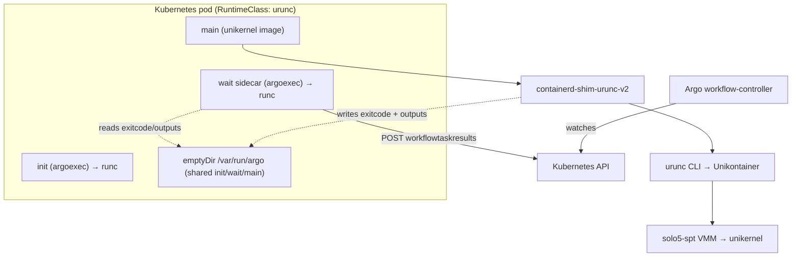
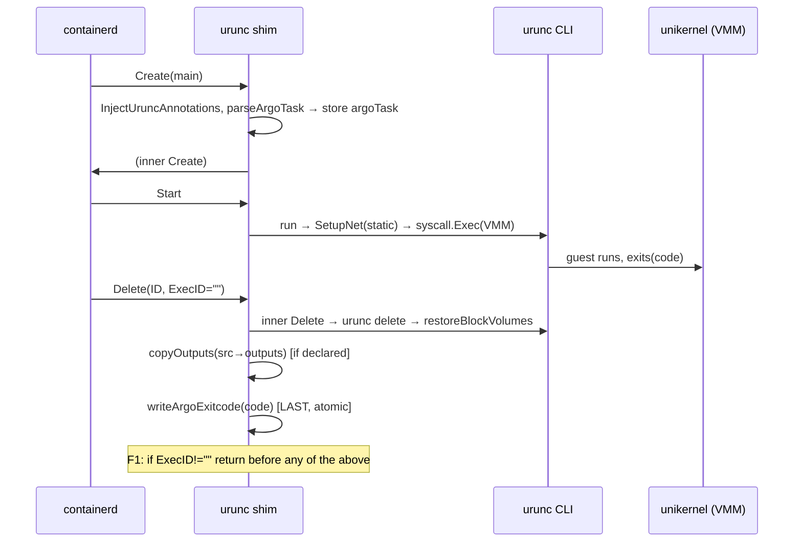
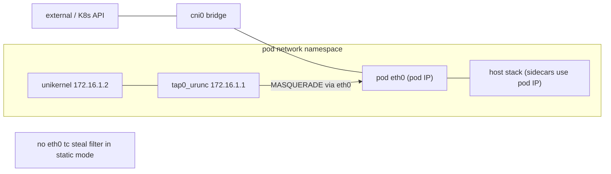
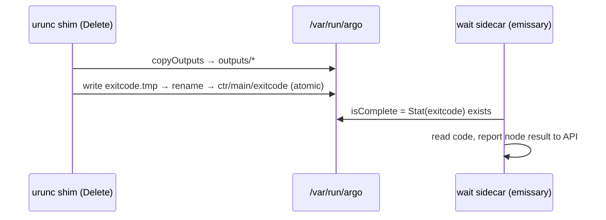
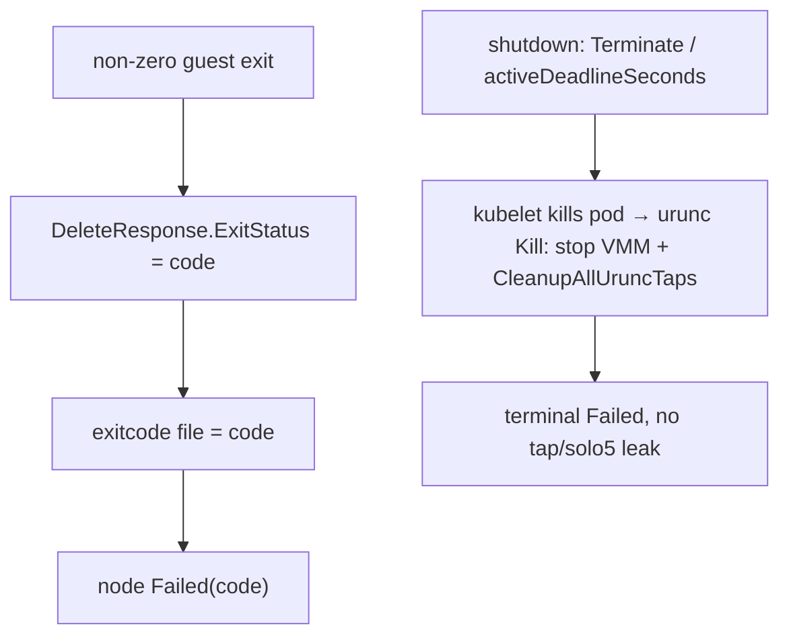
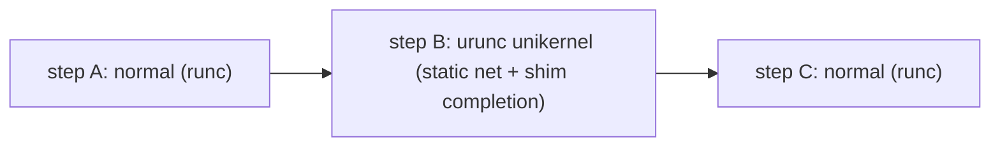

# urunc ↔ Argo Workflows Integration — Architecture & Design

Status of this document: research/design record for the LFX mentorship. It describes the integration
implemented on branch `argo-poc-integration` (urunc `0.7.0-c6bcc89` line).

> **CORRECTIONS (2026-08-16 factuality audit).** This file is a copy of the VM original, refreshed on
> 2026-08-16 (it replaced an older draft in this directory that wrongly described emissary completion as an
> `inotify WaitForCreate` watch; emissary v3.6.5 uses `os.Stat` in a 1 s poll loop — see §"Completion
> signaling" below, which is correct). Two statements below are superseded by
> `COMPATIBILITY_AND_ROADMAP_CONCISE.md`:
> 1. **Exit-code source** (§ "Exit codes", marked `[UNVERIFIED]`) is now resolved: the workflow controller
>    takes the node exit code from the pod's terminated container status
>    (`workflow/controller/operator.go:1528-1531`, used at `:1462`), **not** from the exitcode file. The
>    exitcode file is purely a completion token.
> 2. **The rejected-alternatives entry** for the L2 bridge is labelled `[VERIFIED in disposable-netns
>    tests]`; **no such test artifact exists** and the label is withdrawn — see the inline note there.
>
> The same one-line correction (2) still applies to the VM original at `~/urunc-src/ARGO_URUNC_ARCHITECTURE.md`.

**Evidence labels used throughout**
- **[CODE]** — traced in the checked-out source (file + function cited).
- **[VERIFIED]** — demonstrated by an executed unit test or a live pod/POC run, with the result stated.
- **[OBSERVED]** — seen live but not as a formal repeatable test.
- **[DOC]** — upstream Argo/containerd/urunc documentation or a maintainer statement in an issue.
- **[PROPOSED]** — design not yet implemented.
- **[UNVERIFIED]** — investigated but not demonstrated.

**Test environment for all [VERIFIED]/[OBSERVED] items:** single-node k3s `v1.36.2+k3s1`; urunc
`0.7.0-c6bcc89-dirty` (this branch); monitor `solo5-spt`; **no `/dev/kvm`**; Argo Workflows `v3.6.5`
(emissary executor); containerd `v2.2.6` (system) with the devmapper snapshotter for the urunc runtime.
No KVM monitor, no multi-node cluster, and no shared-fs path were exercised.

The branch changes exactly three production files plus two new test files [CODE, `git diff --stat`]:
`pkg/containerd-shim/task_service.go`, `pkg/unikontainers/config.go`,
`pkg/unikontainers/unikontainers.go`; new `pkg/containerd-shim/argo_test.go`,
`pkg/unikontainers/argo_test.go`; new repo-root `mentorship` document.

---

## 1. Executive Summary

Argo Workflows orchestrates DAGs of Kubernetes pods. urunc runs a pod's "main" workload as a unikernel
inside a VMM sandbox instead of a normal Linux container. Three of Argo's pod-level assumptions break
under that model, and this integration addresses them with minimal, gated changes:

1. **Networking** — Argo's `wait` sidecar must reach the Kubernetes API. urunc's default ("dynamic")
   network mode installs a catch-all tc-redirect that steals all inbound traffic on the shared pod
   netns for the unikernel's tap, blinding the sidecar. **Fix:** for Argo main containers, select
   urunc's existing `static` network mode, which does not install that steal filter. [CODE/VERIFIED]
2. **Completion signaling** — Argo's emissary executor expects the exit-code file
   `/var/run/argo/ctr/<name>/exitcode`, normally written by `argoexec` inside the main container. urunc
   `syscall.Exec`s the VMM directly and discards the `argoexec` wrapper, so the file is never written
   and the workflow hangs. **Fix:** the urunc shim writes that file from its `Delete` handler using the
   real guest exit status. [CODE/VERIFIED]
3. **Outputs without shared-fs** — the lightweight monitors urunc targets (spt/hvt/firecracker) have no
   shared filesystem, so Argo's shared-volume output path is unavailable. **Fix (partial):** when a
   main container declares an output block volume, the shim copies its files into the shared Argo
   emptyDir during `Delete`, before writing the completion file. [CODE/VERIFIED at the shim-mechanism
   level; guest-side writing and Argo-native artifact/parameter consumption are not yet implemented].

Two robustness fixes were added on top (this branch): **F1** guards exec-process deletes from consuming
the main container's completion state; **F2** publishes the exit-code file atomically (temp+rename).

**What is proven today:** completion signaling, static-mode networking + sidecar coexistence,
concurrency isolation, failure/cancel/timeout terminal states with no leaks, and the shim output-copy
mechanism — all on solo5-spt, single-node (§7). **What remains for mentorship:** full Argo-native
artifact/parameter chaining, lifecycle retry/idempotency, filesystem hardening, KVM/multi-node
validation, CI wiring, and documentation (§8). **This document does not claim the implementation is
production-ready, complete, or secure.**

---

## 2. Argo Execution Model (only what is relevant here)

[DOC: Argo Workflows v3.6.5; maintainer analysis in urunc issue #135; emissary package
`workflow/executor/emissary`.]

Argo compiles each workflow node into a Kubernetes pod. For a `container`/`script` template the pod has:

| Container | Image | Role |
|---|---|---|
| `init` | `argoexec` | stages inputs, copies the `argoexec` binary into a shared `emptyDir` |
| `main` | user image | the workload; Argo rewrites its command to `argoexec emissary -- <user cmd>` |
| `wait` (sidecar) | `argoexec` | watches `main`, collects outputs/logs, reports the node result to the workflow-controller via the Kubernetes API |

Relevant expectations:

- **Executor:** the only executor in the tested Argo is **emissary** [VERIFIED: the argoexec v3.6.5
  binary on the VM contains exactly one `ContainerRuntimeExecutor` implementation — emissary; no
  `k8sapi`/`pns`/`docker` strings]. Argo rewrites the `main` command to `argoexec emissary -- <user cmd>`
  [VERIFIED: the `urunc-repro` main container's OCI args were
  `['/var/run/argo/argoexec','emissary','--loglevel','info',...,'--','/hello',...]`]. The emissary main
  process runs the user command and writes `/var/run/argo/ctr/<name>/exitcode` (a shared `emptyDir`
  mounted at `/var/run/argo` in `main` and `wait`) [DOC/CODE: the emissary-side write is in `argoexec`,
  not traced to source line-by-line here].
- **Completion signaling:** the `wait` sidecar's emissary `isComplete` returns true when the exitcode
  file **exists** (`os.Stat`, checked in a 1-second poll loop); it does **not** read or parse the file
  content [VERIFIED: emissary v3.6.5 source `workflow/executor/emissary/emissary.go` `isComplete`/`Wait`].
  Where the exit-code *value* is obtained (from the file content elsewhere in `argoexec`, or from the
  Kubernetes pod container status) was **not** traced to source here [UNVERIFIED]. This makes the file's
  atomic appearance relevant (§5 F2).
- **Networking:** `wait` reports node results by `POST`ing to `…/workflowtaskresults` on the Kubernetes
  API service IP; it needs working pod networking to the API [OBSERVED: without it, `wait` logs
  `dial tcp 10.43.0.1:443: connect: no route to host` indefinitely].
- **Outputs/artifacts:** declared `outputs.parameters/artifacts` have in-container paths; `argoexec`
  (in `main`) reads those declared paths and `wait` collects them [DOC]. The requirement is that
  `argoexec` can **read the declared output paths of the running workload** — not that the whole main
  filesystem is exposed. With a unikernel this fails because `argoexec` does not run and (on the tested
  monitors) there is no shared filesystem to the guest.
- **Exit codes:** the node's result includes the main container's exit code [OBSERVED live: node
  `outputs.exitCode` matched the guest exit]. Whether Argo reads it from the exitcode file content or
  from the Kubernetes container status was not traced to source here [UNVERIFIED].
- **Cancellation/timeout:** `spec.shutdown: Terminate` and `activeDeadlineSeconds` cause Argo/kubelet to
  terminate the pod; the node moves to a terminal `Failed`.

**Two independent incompatibility roots** (they are separate causes, not one):
- **(A) Executor bypass** — completion signaling and output collection assume `argoexec` runs *inside*
  the main container; urunc `syscall.Exec`s the VMM and discards the `argoexec` wrapper (§3), so the
  exitcode file is never written and declared outputs are never staged. This is the cause of the
  completion and output incompatibilities.
- **(B) Shared network namespace + urunc's dynamic tap steal** — the `wait` sidecar and the unikernel
  share the pod netns; urunc's *dynamic* network mode installs a catch-all tc-redirect on `eth0` for the
  guest tap (`pkg/network/network_dynamic.go`), which blackholes the sidecar's inbound traffic. This is
  **independent of the executor bypass** and is the cause of the sidecar-networking incompatibility.

---

## 3. urunc Execution Model (traced)

[CODE. Files under `pkg/` and `cmd/urunc/` on this branch.]

```
kubelet → CRI → containerd (runtime handler "urunc")
  → containerd-shim-urunc-v2  (pkg/containerd-shim/*)
    → inner containerd runc task service (vendored)
      → urunc CLI (cmd/urunc/*)  [create|start|kill|delete|ps]
        → Unikontainers (pkg/unikontainers/*)
          → hypervisor/VMM (pkg/unikontainers/hypervisors/*)  e.g. solo5-spt
            → unikernel guest
```

**Delegation of non-unikernel containers** — `cmd/urunc/create.go`: `unikontainers.New(...)` returns
`ErrNotUnikernel` (or `ErrQueueProxy`) for a container without `com.urunc.unikernel.*` annotations; the
CLI then calls `runcExec()`, handing the container to runc unchanged [CODE]. This is why Argo's `init`
and `wait` (plain `argoexec`) run as normal Linux containers even though the pod's RuntimeClass is
`urunc`.

**Task Create/Start/Delete** —
- *Create:* the shim `taskService.Create` injects urunc image-label annotations into the bundle
  `config.json` (`InjectUruncAnnotations`) then forwards to the inner service [CODE
  `pkg/containerd-shim/task_service.go`].
- *Start/run:* for a unikernel, urunc sets up rootfs/block/network, then **`syscall.Exec`s the VMM**
  (`pkg/unikontainers/unikontainers.go:766`). After this call, no urunc code runs in that process — it
  *becomes* the monitor. Consequence: urunc cannot write anything "after the guest exits" from inside
  the container process.
- *Delete:* the shim `taskService.Delete` calls the inner Delete, which runs `urunc delete` →
  `Unikontainer.Delete` (`unikontainers.go:842`). That function calls `restoreBlockVolumes`
  (`unikontainers.go:859`) early, before teardown of directories.

**Networking path** — `Unikontainer.SetupNet` (`unikontainers.go`) selects a network manager by
`getNetworkType()` and calls `NetworkSetup` inside the pod's joined network namespace. Two modes exist
(`pkg/network/`): `dynamic` (`network_dynamic.go`, installs a tap + tc ingress redirect that steals all
eth0 inbound to the tap) and `static` (`network_static.go`, `addTCRules=false`, tap `172.16.1.1/24`,
guest `172.16.1.2`, `setNATRule` installs `iptables -t nat -A POSTROUTING … MASQUERADE` + `ip_forward=1`)
[CODE; constants in `internal/constants/network_constants.go`]. Note: `SetupNet` currently **logs and
swallows** a `NetworkSetup` error (`"Failed to setup network … Possibly due to ctr"`) and returns nil
[CODE — relevant to observability, §10].

**Block storage lifecycle** — `pkg/unikontainers/block.go`: `getBlockVolumes` (create path) identifies
bind-mounted, guest-FS-supported block volumes, pins the loop device (`setLoopAutoclear(false)`) and
unmounts the host copy so the guest can own it; `restoreBlockVolumes` (delete path) remounts the source
host-side at its original mountpoint [CODE]. Guest-FS support is per-unikernel (e.g. rumprun supports
ext2; mirage `SupportsFS` = false) and shared-fs is per-monitor (`SupportsSharedfs()` returns false for
spt/hvt/firecracker/hedge — `pkg/unikontainers/hypervisors/*.go`).

**Sandbox teardown** — `Unikontainer.Kill` (`unikontainers.go:806`) joins the sandbox netns, stops the
VMM, and calls `network.CleanupAllUruncTaps()` (`unikontainers.go:833`) to remove urunc tap devices and
their tc rules; `Unikontainer.Delete` restores block volumes and removes directories.

**What stays standard containerd/runc:** the shim embeds and forwards to the vendored containerd runc
task service; `init`/`wait` sidecars are literally runc containers; only the annotated unikernel main
diverges into the urunc path.

---

## 4. Compatibility / Incompatibility Matrix

| Argo assumption | urunc behavior [CODE] | Incompatibility | Impact | Current solution | Evidence / status | Remaining |
|---|---|---|---|---|---|---|
| `argoexec` runs in `main` and writes `exitcode` | urunc `syscall.Exec`s the VMM, discarding the `argoexec` wrapper (`unikontainers.go:766`) | exitcode file never written | workflow hangs (`wait` waits forever) | shim writes `ctr/<name>/exitcode` in `Delete` (`writeArgoExitcode`) | [VERIFIED] hang→terminal; node exitCode correct | — |
| `wait` sidecar reaches the K8s API over shared pod netns | dynamic mode installs catch-all tc steal on eth0 for the tap (`network_dynamic.go`) | sidecar inbound blackholed | `wait` cannot report results → hang | select `static` mode for Argo main (`getNetworkType`→`argoWorkflowContext`); static uses `addTCRules=false` + MASQUERADE | [VERIFIED] 0 steal filters, `Main container completed`, 0 route-to-host errors | inbound DNAT for guest-serving (§8) |
| `argoexec` can read the workload's declared output paths | `argoexec` does not run in the guest; and no shared-fs on spt/hvt/fc (`SupportsSharedfs=false`) | declared outputs not reachable by `argoexec`/`wait` | outputs not collectable via emissary | shim copies a declared **block** output volume into `/var/run/argo/outputs` during Delete (`copyOutputs`) | [VERIFIED] shim-mechanism only (§9) | guest-write + Argo-native consumption (§9) |
| Delete finalizes the container and yields its exit status | inner runc Delete finalizes only when `r.ExecID == ""`; `DeleteResponse.ExitStatus` is the targeted process's status | an exec-process Delete would consume the main's completion state / wrong code | wrong exit code or hang if an exec occurs on main | **F1**: shim `Delete` returns early when `r.ExecID != ""` | [VERIFIED] `TestDeleteExecIDDoesNotConsumeArgoTask`, `-race` clean; not triggered live (urunc has no exec) | — |
| completion is keyed on the exitcode file's existence (`os.Stat`, 1s poll) [VERIFIED src] | `os.WriteFile` creates-then-writes: the file exists empty before content lands | the file can exist while empty | completion could be signaled before content is finalized; impact depends on how the code value is read (not traced, §2) — treated as a hardening concern, not an observed failure | **F2**: temp file + `os.Rename` (atomic on the same filesystem), 0644, temp cleaned on failure | [VERIFIED] unit test + live (`exitcode` correct, perm 644, 0 stale tmp); the empty-window race was **not** observed to fire | — |
| non-zero exit / crash propagates to Failed | guest exit status surfaced via `DeleteResponse.ExitStatus` | none (works) | — | exitcode file carries the real code | [VERIFIED] Failed, exitCode 1 | — |
| timeout / cancellation → terminal, clean | Kill stops VMM + `CleanupAllUruncTaps` | none observed | — | existing urunc kill/cleanup path | [VERIFIED] Failed, 0 solo5/tap leaks | capture running-guest-at-cancel more tightly |
| concurrent workflows isolated | each pod has its own netns; static IPs are netns-local; shim map is mutex-guarded, keyed by container ID | none observed | — | existing netns isolation + per-ID `argoTask` | [VERIFIED] 4 concurrent, distinct pod IPs, no collisions | — |
| non-Argo urunc workloads unchanged | `parseArgoTask`/`argoWorkflowContext` gate; sidecars delegated pre-`SetupNet` | none (by construction) | — | triple-gate + delegation | [VERIFIED] bare pod stays `dynamic` | — |
| pod teardown releases runtime resources | force-delete can leak devmapper thin-device mounts; snapshotter loops `device or resource busy` | new urunc pod creation stalls (runc unaffected) | node degradation under `--force` churn | none (baseline behavior) | [OBSERVED] recovered by reboot; **not** caused by this branch | root-cause + teardown ordering (§8) |
| loopback devmapper pool survives reboot | pool has no boot unit | pool absent on boot → CRI fails → node NotReady | cluster down after reboot | environment-level `containerd-thinpool.service` (not urunc code) | [VERIFIED] reattach before containerd, node Ready | fold into deploy docs |

This table covers the incompatibilities exercised by the tests in §7; it is not claimed to be an
exhaustive analysis of every possible Argo/urunc interaction. Items marked [OBSERVED] are environmental
and were not caused by this branch.

---

## 5. Current Architecture

### 5.1 Argo workload detection and gating [CODE]

Two independent detectors, because two Go packages are involved:

- **Network side** (`pkg/unikontainers/unikontainers.go`): `getNetworkType()` →
  `argoWorkflowContext(spec)`. Returns `static` if the `com.urunc.unikernel.sandboxProfile` annotation
  == `argo-workflow`, or (annotation absent) if `isArgoEmissaryMain` matches
  (`filepath.Base(args[0])=="argoexec" && args[1]=="emissary"`). Any other explicit profile value →
  `dynamic`. This path is only ever reached for unikernel containers, because non-unikernels are
  delegated to runc in `create.go` **before** `SetupNet` runs — so no separate unikernel check is needed
  here.
- **Shim side** (`pkg/containerd-shim/task_service.go`): `parseArgoTask(bundle)` reads the bundle
  `config.json` and returns an `argoTask` only when **all** hold: (a) `sandboxProfile == argo-workflow`
  OR (absent) emissary argv; (b) the container carries `com.urunc.unikernel.unikernelType` (i.e. it is
  the unikernel main, not an `argoexec` sidecar — the profile annotation is pod-scoped, so this check
  excludes the sidecars); (c) a `/var/run/argo` mount exists (its host `Source` is the shared emptyDir).

Why each check exists:
- `sandboxProfile` — explicit, robust opt-in/opt-out (value `none` force-disables), independent of Argo
  internals.
- emissary argv — zero-config auto-detection fallback for the annotation-less case; preserves prior POC
  behavior.
- `unikernelType` — scopes shim behavior to the main container; without it a pod-scoped profile
  annotation would also match `init`/`wait` and write spurious completion files [VERIFIED: the fix
  removed a `ctr/wait/exitcode` write observed before it].
- `/var/run/argo` mount — locates the shared emptyDir where completion + outputs must land; its path is
  set by kubelet (not guest-controllable).

Constants: `annotSandboxProfile`/`sandboxProfileArgo` are defined in both `config.go` (L49/L54, used by
the network side) and `task_service.go` (used by the shim), because the two live in different packages;
`annotUnikernelType` and `annotArgoOutputVol` are shim-local.

### 5.2 `argoTask` state, Create, and Delete [CODE]

- `taskService.Create` — after the inner Create, if `parseArgoTask` matches, store an `argoTask{exitDir,
  outputSrc, outputDest}` in `s.argoTasks[containerID]` under `s.mu`. Non-Argo containers leave the map
  empty and every hook inert.
- `taskService.Delete` — sequence:
  1. Call inner Delete (runs `urunc delete` → `restoreBlockVolumes`, so the block volume is host-readable
     when this returns).
  2. **F1:** if `r.ExecID != ""` return immediately (exec-process delete, not the container).
  3. Under `s.mu`, claim-and-remove the `argoTask` for `r.ID` (serializes concurrent/repeat Deletes; only
     one caller gets it).
  4. If an output volume was declared, `copyOutputs(outputSrc, outputDest)` — best-effort, logs on error.
  5. **Write the exitcode file LAST**, via `writeArgoExitcode` (F2, atomic).

Completion is written last so the sidecar (which keys on the exitcode file's existence) never observes
completion before the artifacts are on disk [VERIFIED: journal shows `extracted Argo outputs` ~276 µs
before `wrote Argo completion file`].

### 5.3 How the block volume becomes readable, and how outputs are copied [CODE]

`copyOutputs(srcDir,destDir)` walks `srcDir` with `filepath.WalkDir` (which lstat's entries and does not
follow symlinks), skips symlinks and non-regular files, rejects any `..`-escaping relative path, caps
total bytes at `maxExtractBytes` (64 MiB), and copies regular files into `destDir` preserving structure.
On the guest→host **source** side, symlinks are not followed and are skipped [VERIFIED by
`TestCopyOutputsSkipsSymlink` and the real-pod TEST 3, where a planted source symlink was excluded]; the
guest is also dead by Delete time (VMM reaped), so the source is not being concurrently rewritten. Note
this reflects the tested guards, not a formal proof of traversal-safety for all inputs. `copyFile` opens
the **destination** with `O_CREATE|O_TRUNC` and does not use `O_NOFOLLOW`, so destination-side symlink
following is unhardened (see §8/F4).

### 5.4 F1 / F2 [CODE/VERIFIED]

- **F1** mirrors the inner runc task service, which finalizes the container only when `r.ExecID == ""`
  (`containerd@v1.7.33 runtime/v2/runc/task/service.go`); `DeleteRequest` has an `ExecID` field
  (`containerd/api@v1.10.0 runtime/task/v2/shim.pb.go`). **Version note:** these are the module versions
  urunc's `go.mod` pins (verified in `go.mod`), i.e. the code the shim binary compiles against; the
  system containerd on the VM is `v2.2.6`. F1's correctness depends on the vendored contract the shim is
  built with (the `r.ExecID` field and the `ExecID == ""` finalize rule), and the `DeleteRequest` the
  shim receives over ttrpc uses the `api v1.10.0` protobuf types it links — so the differing system
  containerd version does not change the behavior F1 relies on. The guard prevents an exec-process delete
  from consuming or mis-signaling the main container. Test: `TestDeleteExecIDDoesNotConsumeArgoTask`
  (PASS, `-race` clean); not exercised live (urunc has no `exec` subcommand).
- **F2** writes `exitcode.*.tmp` in the **same directory** as the target, `Chmod(0o644)`, then
  `os.Rename` into place. The atomicity guarantee is specifically that of a POSIX `rename(2)` **within a
  single filesystem** — the temp is created in the target directory so it shares the target's filesystem;
  `os.Rename` across filesystems is not atomic, and is not used here. A deferred `os.Remove` cleans up
  the temp on any failure. Preserves the decimal format and 0644 permission. Test:
  `TestWriteArgoExitcodeAtomicNoTempLeftover` (PASS); live: `exitcode`=0/1, perm 644, 0 stale tmp.

### 5.5 Diagrams

**(1) Component architecture**


**(2) Main-container lifecycle**


**(3) Network/data flow (static mode)**


**(4) Storage / artifact flow**


**(5) Completion sequence**


**(6) Failure / cancellation**


**(7) Mixed workflow**


---

## 6. Why the Current Design Is Minimal and Safe

| Decision | Rationale [CODE] | Maintainer-guidance alignment |
|---|---|---|
| Reuse `StaticNetwork` instead of a new subsystem | static mode already exists (Knative `user-container` uses it), already gives NAT egress + no steal; the change is one branch in `getNetworkType` | small, justified, isolated patch |
| Use the existing OCI/containerd `Delete` lifecycle | `restoreBlockVolumes` already runs there; the shim already wraps `Delete`; no new lifecycle | no new machinery; reuse |
| No Argo fork/patch | detection via annotations/argv + writing the exact emissary exitcode file; no change to `argoexec` | "no unnecessary Argo patching" |
| Gate strictly to Argo unikernel main | `parseArgoTask` triple-gate + runc delegation of sidecars | no regression to non-Argo/sidecars |
| Avoid shared-fs reliance | outputs move via a block volume + host copy, not a shared mount | respects "shared-fs may be disabled" |
| Keep normal urunc unchanged | non-Argo → empty `argoTasks`, dynamic net; verified bare pod unaffected | no regression |
| Small, modular surface | 3 production files; pure helper functions with unit tests | maintainable, reviewable |

Maintainer guidance referenced [DOC, issue #573 / #135 threads]: (1) shared-fs may be disabled for
security, so a solution must not rely solely on it — met by the block-volume copy path; (2) any Argo
patch should be small, justified, and not affect other Argo cases — met by keeping all logic in urunc
and gating it to the annotated main container.

---

## 7. Verified Validation

| Test | Environment | Result | Proves | Limitations |
|---|---|---|---|---|
| Mixed Argo DAG `normal→urunc→normal` | live, spt, 1-node | **Succeeded ~35s**; all 3 nodes green; runtime classes correct; 0 leaks | urunc + normal steps coexist; urunc step can succeed and feed downstream | spt only |
| Non-zero exit (`hello-spt-mirage`, net-less abort) | live | **Failed**, node exitCode **1**, main terminated 1, exitcode `[1]` perm 644, 0 route-to-host, 0 leaks | correct failure propagation, no hang | — |
| Cancellation (`shutdown: Terminate`) | live | → **Failed**, 0 solo5/tap/shim leaks | clean terminal + cleanup | running-guest-at-cancel not tightly captured this run |
| Timeout (`activeDeadlineSeconds`) | live | → **Failed**, 0 leaks | deadline path terminal, clean | — |
| Concurrency (4 simultaneous workflows) | live | distinct pod IPs, all **Succeeded ~18s**, no collisions; bare non-Argo pod unaffected | isolation + no cross-workflow collision | 4-way, 1-node |
| Non-Argo regression (bare `net-spt-mirage`) | live | **Running**, `dynamic` mode (steal filter present) | no regression to normal urunc | — |
| Output extraction (real pod, `argoOutputVolume`, pre-seeded hostPath) | live | shim `files=2` (symlink excluded); on-disk `outputs/result.txt`=marker, `logs/run.log`, perm 644, no symlink | shim extraction + symlink guard in a real pod lifecycle | **guest-write simulated**; no Argo-native consumption |
| Extraction-before-completion ordering | live journal | `extracted Argo outputs` ~276 µs before `wrote Argo completion file` | ordering guarantee | — |
| F1 ExecID guard | unit + `-race` | `TestDeleteExecIDDoesNotConsumeArgoTask` **PASS** | exec delete preserves main state | not exercised live (urunc has no exec) |
| F2 atomic exitcode | unit + live | `TestWriteArgoExitcodeAtomicNoTempLeftover` **PASS**; live perm 644, 0 stale tmp | atomic publication, no temp leak | empty-window race not observed to fire |
| Shim unit suite | `go test ./pkg/containerd-shim/` | **8/8 PASS**, `-race` clean | helper correctness | shim pkg not in `make unittest` |
| Reboot / thin-pool recovery | live (Oracle-console reboot) | `containerd-thinpool.service` reattached pool **before** containerd; **0 pool-query-failures**; node Ready; NRestarts=0 | boot-persistence unit works | environment-level, not urunc code |
| Post-reboot Argo/urunc smoke | live | workflow **Succeeded ~13s**, 0 leaks | integration survives reboot | spt, 1-node |

**Evidence classification summary:** completion signaling, static networking, concurrency, failure/
cancel/timeout, non-Argo regression = **real-pod E2E** on solo5-spt single-node. F1 = **unit + race**.
F2 = **unit + live**. Output extraction = **shim-mechanism real-pod E2E**, with guest-write simulated and
**no** Argo-native artifact/parameter consumption. **Untested:** KVM monitors, multi-node, shared-fs.

---

## 8. Remaining Mentorship Work

For each: **Current state · Gap · Proposed architecture · Implementation · Mechanism/why · Risks ·
Mitigation · Scope.** Only code-supported items are listed. Detailed artifact-chaining design is in §9.

### 8.1 Full Argo-native artifact/parameter chaining → see §9 (own section). Scope: **initial mentorship**.

### 8.2 Output parameters
- **Current:** the shim copies output *files* into `/var/run/argo/outputs` [VERIFIED §7]. Argo output
  *parameters* (`outputs.parameters[].valueFrom.path`) are resolved by emissary, which does not run.
- **Gap:** parameters are not surfaced to the workflow-controller.
- **Proposed:** map the guest's declared parameter paths (from the block volume) into the exact layout
  the `wait` sidecar's emissary reads, or have the shim emit the parameter values into that layout.
- **Implementation:** `pkg/containerd-shim/task_service.go` (extend `copyOutputs`/staging); requires
  knowing emissary's expected parameter file layout [DOC needed].
- **Mechanism/why:** reuse the existing Delete-time host access; no Argo change if the layout matches.
- **Risks:** emissary layout is an upstream contract that could change; misplacement = silent loss.
- **Mitigation:** pin to the tested Argo version; add an e2e assertion that a downstream step reads the
  parameter. **Scope: initial mentorship.**

### 8.3 Input artifacts/parameters
- **Current:** inputs are staged by Argo's `init` (runc) into the shared emptyDir; the guest cannot read
  the emptyDir (no shared-fs) [CODE: `SupportsSharedfs=false`].
- **Gap:** getting inputs *into* the guest sandbox.
- **Proposed:** stage inputs into a block volume the guest mounts (mirror of the output path), populated
  before `syscall.Exec`.
- **Implementation:** `pkg/unikontainers` create path + block.go; possibly a shim pre-Start hook.
- **Mechanism/why:** block volume is the shared-fs-independent channel already proven for outputs.
- **Risks:** ordering (inputs must exist before guest start); image must mount the input volume.
- **Mitigation:** unit + e2e with a real input file. **Scope: initial/later mentorship.**

### 8.4 Logs / log streaming — see §10. Scope: **later mentorship**.

### 8.5 Lifecycle retry / idempotency (F3)
- **Current:** `Delete` removes the `argoTask` before doing the work; exitcode write is best-effort
  (logs on failure) [CODE]. Not observed to fail (tmpfs writes succeeded).
- **Gap:** a transient exitcode-write failure is unrecoverable (tracking already gone) → potential hang.
- **Proposed:** on write failure, re-insert the claimed entry and return an error so containerd retries
  Delete; make the retry idempotent (guest already dead).
- **Implementation:** `taskService.Delete` (`task_service.go`).
- **Mechanism/why:** containerd retries a failed Delete; the guest is gone so re-writing is safe.
- **Risks:** a retried Delete hits an already-deleted inner container (`resp==nil`) — the exitcode work
  must proceed independently; changing Delete's error contract has regression surface.
- **Mitigation:** design with maintainers; e2e fault-injection test. **Scope: later mentorship.**

### 8.6 Destination-side filesystem hardening (F4)
- **Current:** `copyFile`/`writeArgoExitcode` open the destination with `O_CREATE|O_TRUNC`, following
  symlinks in the destination path [CODE]. On the evidence gathered: the guest writes to its block
  device, not to the host emptyDir, and the source-side copy skips symlinks [VERIFIED by test], so no
  guest-controlled path was shown to redirect the copy. This is scoped to what was tested — it is not a
  proof that no such vector exists.
- **Gap:** a co-pod container with write access to the shared `/var/run/argo` could pre-plant a symlink
  the root shim would write through. Not proven exploitable.
- **Proposed:** open destinations with `O_NOFOLLOW` (or `openat2` `RESOLVE_BENEATH`).
- **Implementation:** `copyFile`, `writeArgoExitcode`.
- **Risks:** could reject a legitimate symlinked layout; needs threat-model agreement.
- **Mitigation:** guard behind the same tests; discuss with maintainers. **Scope: later mentorship.**

### 8.7 Guest inbound networking / DNAT
- **Current:** static mode gives the guest `172.16.1.2` with egress NAT; it is reachable on `172.16.1.2`
  but **not** on the pod IP [VERIFIED: pod-IP:8080 closed, 172.16.1.2:8080 open].
- **Gap:** serving a unikernel step on the pod IP.
- **Proposed:** in-netns DNAT `podIP:port → 172.16.1.2:port` for declared ports (conntrack reverses
  replies).
- **Implementation:** `pkg/network/network_static.go` (a `setDNATRule` mirror of `setNATRule`).
- **Risks:** needs `nf_conntrack`; must not shadow sidecar ports.
- **Mitigation:** restrict to declared ports; e2e serve test. **Scope: later mentorship / optional** (most
  Argo steps are batch).

### 8.8 devmapper forced-delete cleanup
- **Current:** `--force --grace-period=0` deletes leaked thin-device mounts → snapshotter
  `device or resource busy` loop → urunc pod-creation stall (runc unaffected); reboot recovers
  [OBSERVED]. Not root-caused to a urunc ordering bug.
- **Gap:** graceful teardown ordering under ungraceful deletion.
- **Proposed:** ensure guest mounts are released before thin-device deactivation.
- **Implementation:** `Unikontainer.Delete` (`unikontainers.go`), `block.go`.
- **Risks:** touches teardown ordering; regression surface.
- **Mitigation:** reproduce deterministically first; test at scale. **Scope: later mentorship**
  (baseline, not Argo-specific).

### 8.9 KVM / alternative monitors
- **Current:** all results are solo5-spt; qemu/firecracker/cloud-hypervisor and shared-fs untested here.
- **Gap:** validate completion/network/extraction on KVM monitors (some support shared-fs).
- **Proposed:** re-run §7 on a KVM host; add a shared-fs output path where available.
- **Risks:** monitor-specific network/block behavior may differ.
- **Mitigation:** matrix testing. **Scope: Phase 5 mentorship.**

### 8.10 Multi-node Kubernetes
- **Current:** single-node only.
- **Gap:** cross-node scheduling, per-node devmapper/thin-pool, CNI variance.
- **Proposed:** multi-node cluster validation.
- **Risks:** environment-specific.
- **Mitigation:** CI cluster. **Scope: Phase 5.**

### 8.11 CI / integration-test wiring
- **Current:** shim tests run via `go test ./pkg/containerd-shim/`; **not** in `make unittest`
  (which runs `test_unikontainers test_metrics test_network test_hypervisors test_unikernels` — Makefile)
  [CODE].
- **Gap:** no CI coverage for the Argo shim logic; no e2e Argo job.
- **Proposed:** add a `test_shim` unittest target; add a `kind`-based Argo e2e (RED-today sidecar-reaches-
  API case).
- **Risks:** e2e needs a devmapper-capable runner.
- **Mitigation:** reuse the existing e2e harness (`tests/e2e`, `SideContainers` field). **Scope: Phase 5.**

### 8.12 Broader storage backends / CSI
- **Current:** output channel is a locally-provided block volume; k3s local-path PVCs are filesystem, not
  block [OBSERVED].
- **Gap:** a first-class block-backed volume (CSI block volume) for inputs/outputs.
- **Proposed:** use CSI block-mode volumes as the guest input/output channel.
- **Risks:** CSI driver availability; lifecycle coupling.
- **Mitigation:** prototype with a loop-backed block CSI. **Scope: later.**

### 8.13 Cancellation / retry / resubmission / pod restart semantics
- **Current:** cancel/timeout terminal + clean [VERIFIED]; `restartPolicy: Never` used in tests.
- **Gap:** workflow resubmission and pod restart (RestartPolicy) interaction with the shim `argoTask`
  map (in-memory, per-shim) not tested.
- **Proposed:** verify resubmission creates fresh state; confirm no stale-entry reuse across restarts.
- **Risks:** in-memory map lost on shim crash (bounded, per-pod).
- **Mitigation:** e2e resubmission test. **Scope: Phase 3.**

### 8.14 Observability / debug logging — see §10. **Scope: Phase 1/6.**

### 8.15 Documentation / tutorial / deployment
- **Current:** `mentorship` doc + this doc + §12 reuse guide.
- **Gap:** a user-facing tutorial (LFX deliverable).
- **Scope: Phase 6.**

### 8.16 Maintainability / upstream cleanup
- **Current:** annotation constants duplicated across two packages; `SetupNet` swallows network errors
  [CODE].
- **Gap:** shared constants location; explicit network-error handling (relates to urunc #417).
- **Scope: Phase 6, with maintainers.**

---

## 9. Full Artifact Chaining Design

**Proven today at the shim-mechanism level [VERIFIED §7, with guest-write simulated]:** the
`restoreBlockVolumes (host mount) → copyOutputs → /var/run/argo/outputs` portion (regular files only,
symlinks skipped, before completion). The `unikernel → block volume` portion (the guest actually writing
the files) was **not** exercised — in TEST 3 the output volume was a pre-seeded hostPath.

**Target:** `Argo input artifact/parameter → urunc step → guest processing → Argo output
artifact/parameter → next step`.

**Argo's actual mechanisms** [DOC]: inputs are staged by `init` into the shared emptyDir; the guest
cannot read that emptyDir (no shared-fs). Outputs/params are declared with in-container paths and are
resolved by emissary in `main` and collected by `wait`. The core obstacle both ways is the **absence of
shared-fs between the guest and the emptyDir**.

Where data must live and when:

| Stage | Location | When accessible | urunc role |
|---|---|---|---|
| input staged by Argo `init` | emptyDir (host) | before main Start | must relay into a guest-readable block volume |
| guest reads input | guest mount (block) | during guest run | mounts the input block volume |
| guest writes output | guest mount (block) | during guest run | block volume backing |
| host reads output | host mount (`outputSrc`) | after Delete (`restoreBlockVolumes`) | copy to outputs [DONE] |
| Argo consumes output | emptyDir `outputs/` layout emissary/wait expects | after completion | **not yet in the expected layout** |

**One candidate "smallest viable" design [PROPOSED — not the only option; to be decided with maintainers]:**
1. **Inputs:** before `syscall.Exec`, populate an input block volume from the emptyDir-staged inputs
   (a shim pre-Start step, mirroring the output path). The image must mount the input volume at a known
   guest path.
2. **Outputs (already partly done):** keep `copyOutputs`, but **land files in the exact emissary/wait
   output layout** (not a generic `outputs/` dir) so `wait` collects them with **no Argo change**.
3. **Parameters:** the guest writes each declared parameter to a file in the output block volume; the
   shim copies it to the parameter path emissary/wait reads.

**Whether Argo changes are needed:** [UNVERIFIED] — if the shim can reproduce the exact
emissary/`wait` output/parameter file layout, **no Argo fork is required**; this must be confirmed
against the emissary source for the pinned Argo version. If the layout cannot be reproduced from outside
the main container, a minimal, justified `wait`-side hook would be the fallback (consistent with the
Knative precedent, where a small patched executor was used).

**Storage assumptions:** requires a block-backed volume (CSI block or loop-backed) and a unikernel image
that reads/writes it; k3s local-path PVCs are insufficient (filesystem, not block) [OBSERVED].

**Production/generalized evolution [PROPOSED]:** a declarative mapping annotation (input/output volume ↔
Argo artifact/param name); optional CSI block volumes; per-parameter typing. Not needed for the first
viable version.

---

## 10. Logging and Observability

**Current log flow** [CODE/OBSERVED]:
- Normal Argo containers (`init`/`wait`): standard container stdout → `kubectl logs` / Argo log
  collection.
- urunc unikernel `main`: the solo5 console → container stdout via the shim → visible in `kubectl logs`
  [OBSERVED: mirage/rumprun banners appear].
- Failed sandbox startup: urunc logs to the containerd shim log; `SetupNet` currently logs-and-swallows
  network errors [CODE] — failures can be silent at the pod level.
- Runtime/completion/extraction: the shim emits structured logs (`urunc(shim): tracking Argo main
  container`, `extracted Argo outputs files=N`, `wrote Argo completion file code=N`) [VERIFIED in
  journal].

**Proposed observability model [PROPOSED]:**
- **Origin:** keep guest stdout → container logs (works). Add a per-workflow correlation field
  (pod/container ID + workflow node) to the existing shim log lines.
- **Reaching Argo:** guest logs already reach Argo's log collection via container stdout; keep that (no
  new pipe).
- **Useful fields:** network mode selected, output volume + file count, exitcode written, and — new —
  an explicit warning when `SetupNet` fails instead of swallowing it.
- **Debugging failed workflows:** a single INFO line at each Delete decision (Argo-detected? outputSrc?
  exit code) already exists; add the network-mode and net-setup-result line.
- **Avoiding noise/duplication:** the shim already logs only for tracked Argo main containers (gated),
  so non-Argo workloads stay quiet; keep that discipline.

Scope: low-risk logging additions are **Phase 1**; the `SetupNet` error-handling change touches shared
code and is **Phase 6** with maintainers (relates to urunc #417).

---

## 11. Modularity / Reuse Beyond Argo

**Generic runtime capabilities (reusable by other orchestrators) [CODE]:**

| Capability | Where | Generic form |
|---|---|---|
| workload/profile detection | `sandboxProfile` annotation + `getNetworkType` gate | "select network policy by profile annotation" |
| network policy selection | `getNetworkType` → static/dynamic | already a policy switch |
| post-sandbox artifact extraction | shim `Delete` → `copyOutputs` | "copy a declared block volume to a host dir on teardown" |
| completion callback/publication | shim `Delete` → `writeArgoExitcode` | "write a completion token on teardown" |
| lifecycle hook point | shim `Create`/`Delete` | generic Create/Delete wrappers |

**Argo-specific adapters (thin) [CODE]:**
- annotation value `argo-workflow`; the `/var/run/argo` mount; `argoexec emissary` argv detection; the
  `ctr/<name>/exitcode` path/format; emissary's "existence = complete" semantics.

**Reuse story [PROPOSED — not demonstrated]:** in principle another orchestrator could supply (a) its own
profile value, (b) the location of its shared completion directory, (c) its completion-token format, and
(d) optionally its output layout, while the generic pieces (network-policy selection, block-volume
extraction on Delete, token write on Delete) stay unchanged. **No non-Argo orchestrator has been tested
against this code**; the reusability above is an analysis of the code shape, not a demonstrated
capability, and the current implementation hard-codes the Argo strings (no adapter interface exists yet).

**Clean abstraction boundary [PROPOSED, do not refactor the POC prematurely]:** a small interface such as
`WorkflowAdapter{ Detect(spec) bool; ExitDir(spec) string; OutputMapping(spec) (src,dst string);
WriteCompletion(dir string, code uint32) error }` with an `argoAdapter` implementation. This would
formalize the current hard-coded Argo strings without changing behavior. It is **not** required for the
application and should be introduced only if a second consumer appears.

---

## 12. Branch / Fork Reuse Guide

**What the branch changes (urunc code):** `pkg/containerd-shim/task_service.go` (Argo detection,
`argoTask` tracking, Delete-time output copy + atomic exitcode, F1/F2), `pkg/unikontainers/config.go`
(`sandboxProfile` constants), `pkg/unikontainers/unikontainers.go` (`getNetworkType` →
`argoWorkflowContext`) [CODE, `git diff --stat`].

**Environment / configuration (not urunc code):**
- **General requirement:** containerd `pod_annotations = ["com.urunc.unikernel.*"]` passthrough, so pod
  annotations reach the OCI spec (needed for the `sandboxProfile`/`argoOutputVolume` annotations)
  [OBSERVED: already set on the test VM; any cluster using the annotation path needs this].
- **VM-specific to this test setup, not a general requirement:** this VM uses a **loopback-backed**
  devmapper thin-pool for the urunc runtime and a `containerd-thinpool.service` boot unit to reattach it
  after reboot (§7). A different deployment (e.g. a real block device, or a non-devmapper snapshotter)
  would not need that specific boot unit; it is an artifact of this VM's loopback-pool choice, not part
  of the urunc branch.
- Argo Workflows installed; RuntimeClass `urunc` present.

**Required annotations/config per workflow:**
- `com.urunc.unikernel.sandboxProfile: "argo-workflow"` on the pod (or rely on emissary argv
  auto-detect), plus `runtimeClassName: urunc` (via `podSpecPatch`).
- Optional output extraction: `com.urunc.unikernel.argoOutputVolume: "<guest mount path>"` + a volume
  mounted there.

**Storage assumption:** output extraction currently needs a host-provided volume at the declared mount
(the guest-write path needs a block-backed volume + a writing image — not yet available, §9).

**Networking assumption:** the pod netns/CNI provides `eth0`; static mode NATs the guest via `eth0`.

**Build/install (VM):** `make && sudo make install` (installs `urunc` + `containerd-shim-urunc-v2`).
**Tests:** `go test ./pkg/containerd-shim/` and `go test ./pkg/unikontainers/ -run 'Argo|NetworkType'`.
**Run:** apply an `argo-workflow`-annotated Workflow (examples in
`argo_urunc_evidence_backup/manifests/`).

**Works immediately [VERIFIED]:** completion signaling, static networking + sidecar coexistence,
mixed DAGs, failure/cancel/timeout, concurrency, non-Argo regression, shim output copy (with a
pre-provided volume).
**Unsupported [UNVERIFIED/PROPOSED]:** guest-written outputs end-to-end, Argo-native artifact/parameter
consumption, input artifacts, KVM monitors, multi-node, guest inbound on the pod IP.

---

## 13. Proposed Mentorship Roadmap

Ordering adjusted to the investigation (artifact chaining is the highest-value gap; devmapper/KVM are
environmental and later):

- **Phase 1 — stabilize:** F3 design discussion; logging/observability additions (§10); wire shim tests
  into `make unittest`; a `kind` Argo e2e smoke.
- **Phase 2 — artifact/parameter flow (§9):** output parameters in the emissary layout; input artifacts
  via block volume; a writing unikernel image + block-backed volume; confirm no Argo fork needed.
- **Phase 3 — lifecycle/retry hardening:** F3 (retryable/idempotent completion); resubmission/pod-restart
  semantics; F4 destination hardening.
- **Phase 4 — networking/storage generalization:** guest inbound DNAT (optional); CSI block volumes;
  devmapper forced-delete cleanup root-cause.
- **Phase 5 — CI / KVM / multi-node:** KVM monitor matrix (incl. shared-fs where available); multi-node;
  CI e2e.
- **Phase 6 — upstream cleanup / docs:** shared constants; `SetupNet` error handling; tutorial/deployment
  docs; the §11 adapter boundary if a second consumer appears.

---

## 14. Architecture Decision Record

**What the current architecture intentionally does:** detects Argo unikernel main containers via
annotation/argv, selects urunc's existing static network mode for them (so the sidecar keeps the pod IP
and API access), and — from the shim's `Delete` handler — copies any declared block-volume outputs into
the shared emptyDir and then atomically writes the emissary exitcode file, using the real guest exit
status. Non-Argo and sidecar containers are untouched.

**Why chosen:** it is the smallest change that fixes the three concrete incompatibilities (§4) while
respecting maintainer guidance (no Argo fork; no shared-fs reliance; no non-Argo regression) and reusing
existing urunc mechanisms (static net, block lifecycle, containerd Delete).

**Alternatives considered and rejected:**
- *tc surgical per-MAC filtering* — rejected: **[CODE]** urunc boots the guest with eth0's own MAC
  (`spt.go:72` → `mirage.go:62` `--net-mac`), so guest and sidecar are indistinguishable at L2/L3 in the
  shared netns and no per-MAC/IP filter can separate them.
  *L2 bridge sharing the pod IP* — rejected for the POC: **[UNVERIFIED]** — this entry previously read
  "[VERIFIED in disposable-netns tests]"; **that label is withdrawn, no such test artifact exists.** A
  naive bridge does flap (same MAC on two ports, two stacks answering ARP for the pod IP), but the variant
  with a distinct guest MAC plus ebtables ARP-reply suppression was designed
  (`EXTENDED_POC_BLUEPRINT.md`) and **never tested**. Static/routed NAT was chosen because conntrack makes
  the return path deterministic with zero new network code.
- *Publisher-wrapper to delay `TaskExit` for extraction* — rejected: [CODE] the shim's event forwarder
  is a single serial goroutine; blocking it stalls all event delivery. The `Delete` hook is safe and
  the emptyDir + restored block volume are already available there.
- *Fork/patch `argoexec`* — rejected: unnecessary; writing the exact exitcode file suffices.
- *Rely on shared-fs* — rejected: unavailable on the target monitors and may be disabled for security.

**Explicit assumptions:** pod annotations reach the OCI spec (containerd passthrough); the Argo main
container's argv is `argoexec emissary …` or the profile annotation is set; a block-backed volume is
available for outputs; emissary keys completion on the exitcode file's existence.

**Proven today:** §7 (spt, single-node): completion, networking, concurrency, failure semantics,
non-Argo regression, shim extraction + ordering, F1 (unit/race), F2 (unit/live), reboot recovery.

**Still open:** full artifact/parameter chaining (§9), retry/idempotency (F3), destination hardening
(F4), guest inbound, devmapper cleanup, KVM/multi-node, CI, docs.

**To decide with maintainers:** whether the emissary output/parameter layout can be reproduced from the
shim (no Argo fork) or a minimal `wait`-side hook is acceptable; F3's Delete error-contract change; F4's
threat model; the §11 adapter boundary; and the `SetupNet` error-handling change (urunc #417).

---

*This document was generated from source inspection and executed tests on the environment stated at the
top. Items are labeled VERIFIED / OBSERVED / CODE / DOC / PROPOSED / UNVERIFIED. No claim of
production-readiness, completeness, or security is made beyond the cited evidence.*
