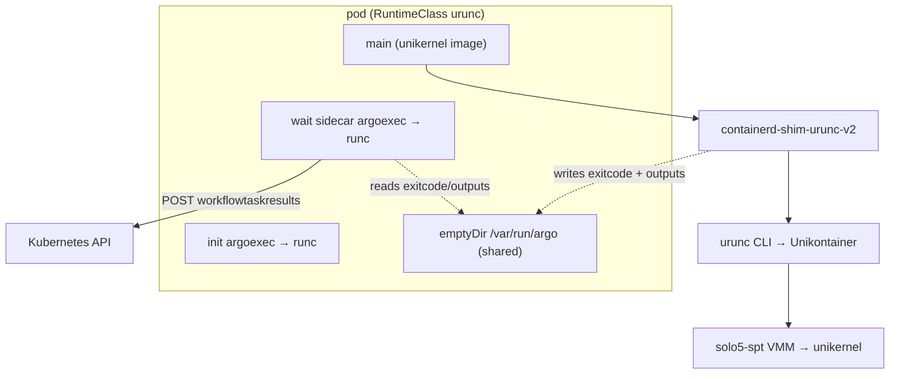
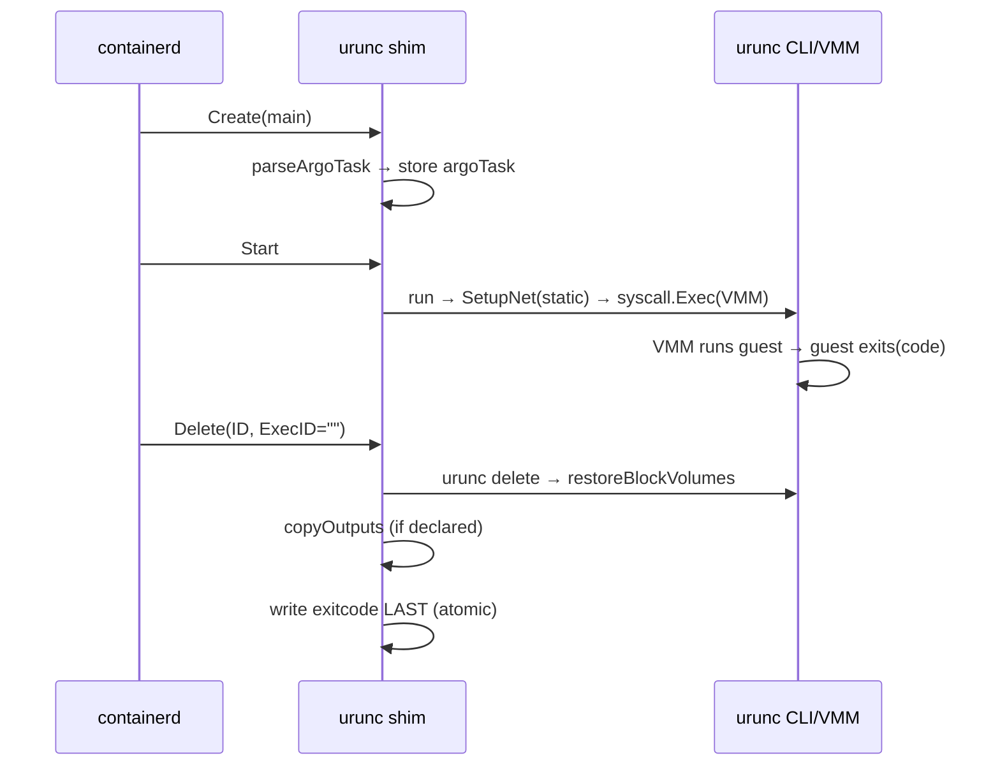
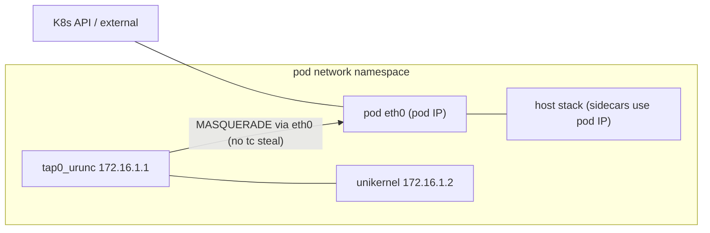
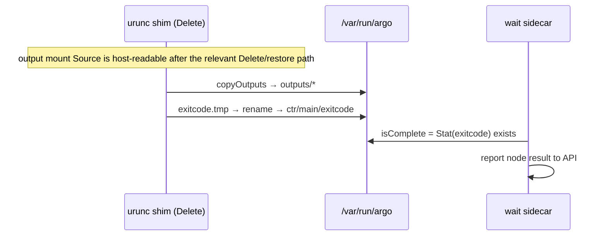
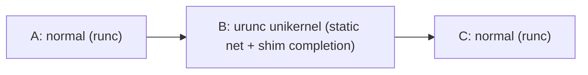

# urunc ↔ Argo Workflows — Compatibility & Roadmap (Concise)

Condensed companion to `ARGO_URUNC_ARCHITECTURE.md` (branch `argo-poc-integration`, urunc `0.7.0-c6bcc89`
line). Raw command output for every live result below is in `LIVE_VALIDATION_2026-08-16.md`.

**Labels:** [VERIFIED] executed test/live run · [OBSERVED] seen live, not a formal test · [CODE] traced in
source · [DOC] upstream/issue doc · [PROPOSED] not implemented · [UNVERIFIED] investigated, not shown.

**Environment for all live results [VERIFIED 2026-08-16]:** single-node k3s `v1.36.2+k3s1`; urunc
`0.7.0-c6bcc89-dirty`; aarch64 Ubuntu 24.04.4; `/dev/kvm` **absent** and `solo5-spt` the **only** monitor
binary installed; Argo Workflows `v3.6.5` (emissary); system containerd `v2.2.6` (devmapper snapshotter for
the urunc runtime). No KVM monitor, multi-node, or shared-fs path was exercised.

**Branch scope [CODE, `git diff --stat`]:** 3 production files — `pkg/containerd-shim/task_service.go`,
`pkg/unikontainers/config.go`, `pkg/unikontainers/unikontainers.go` — plus new tests
(`pkg/containerd-shim/argo_test.go`, `pkg/unikontainers/argo_test.go`) and docs. The Argo changes exist as
uncommitted working-tree changes on the VM checkout; no PR, per the mentorship-issue policy.

---

## 1. Executive Summary

Argo runs DAGs of pods; urunc runs a pod's **main** container as a unikernel in a VMM. Pod-level
assumptions break, from **one unconditional root cause and two conditional ones**:

- **(A) Executor bypass [unconditional]** — urunc `syscall.Exec`s the VMM (`unikontainers.go:766`) and
  discards Argo's `argoexec` wrapper, so the emissary **exitcode file is never written** → workflow hangs,
  and declared **outputs are never staged**.
- **(B) Shared netns + dynamic tap steal [conditional]** — dynamic mode installs a catch-all tc-redirect on
  `eth0` for the guest tap, blackholing the **`wait` sidecar's** API access **for as long as the unikernel
  holds the tap**. Not universal — see §3.1.
- **(N5) Guest command-line corruption [conditional]** — Argo rewrites the main container's argv, and urunc
  feeds argv to the guest as its command line, so argv-sensitive unikernels abort. See §3.2.

**Current solutions [CODE/VERIFIED]:** (B) select urunc's existing **static** network mode for Argo main
containers (no steal filter, NAT egress); (A) the shim writes `ctr/<name>/exitcode` from its `Delete`
handler using the real guest exit status, and, when an output mount is declared, copies that mount's host
tree into the shared Argo emptyDir during `Delete`, before writing completion. This is completion-token
integration, not Argo-native artifact or parameter compatibility. Two robustness fixes: **F1** guards
exec-process deletes from consuming the main's completion state; **F2** publishes the exitcode file
atomically (temp+rename). **(N5) has no solution on this branch.**

**Proven today (solo5-spt, single-node, §7):** completion signaling, static networking + sidecar
coexistence demonstrated against a dynamic-mode control, concurrency isolation, failure/cancel/timeout
terminal states with no leaks, and the shim output-copy mechanism **with guest writes simulated**.
Everything else — listed in §8 — is mentorship work.
**No claim of production-readiness, completeness, or security beyond the cited evidence.**

---

## 2. Argo + urunc Execution Model (essentials)

**Argo pod** [CODE, v3.6.5 source]: `init` (`argoexec init` — loads input artifacts,
`cmd/argoexec/commands/init.go`) · `main` (user image; Argo rewrites its command to
`/var/run/argo/argoexec emissary <logopts> -- <cmd>`, `workflow/controller/workflowpod.go:404`
[VERIFIED live: real main argv was
`["/var/run/argo/argoexec","emissary","--loglevel","info","--log-format","text","--gloglevel","0","--","/hello"]`])
· `wait` sidecar (`argoexec wait`; watches main, collects outputs/logs, reports the node result to the K8s
API as a `WorkflowTaskResult`). Emissary is the only **container-runtime executor** for container templates
in 3.6.5 [CODE: `cmd/argoexec/commands/root.go:131` constructs `emissary.New()` and nothing else]; Argo
retains separate executors for other template types (`resource`, `agent`, `data`), which is why the
`resource`-template path is unaffected by these causes.

**Completion vs. exit code** [CODE]: the `wait` sidecar's emissary `isComplete` returns true when
`/var/run/argo/ctr/<name>/exitcode` **exists** (`os.Stat`, 1 s poll loop); it does **not** parse content
(`workflow/executor/emissary/emissary.go:112,126`). The exit-code **value** the workflow reports comes from
the pod's terminated container status (`getExitCode`, `workflow/controller/operator.go:1528-1531`, used at
`:1462`), **not** from the file. The file's content is read only by a peer emissary in a `containerSet`
dependency wait (`cmd/argoexec/commands/emissary.go:97`), which retries on an unparsable value.
**In this integration the exitcode file is purely a completion token.** `wait` needs pod networking to the
API [VERIFIED §3.1].

**urunc path** [CODE]: `kubelet→CRI→containerd(handler urunc)→containerd-shim-urunc-v2→urunc
CLI→Unikontainer→VMM(solo5-spt)→guest`. The shim reaches the urunc CLI through a **build-time rewrite**:
`Makefile:178,185` seds vendored go-runc's `DefaultCommand` from `"runc"` to `"urunc"` before building the
shim, and no `BinaryName` is set in the bundle — so containerd's inner runc task service execs `urunc` for
`create`/`start`/`kill`/`delete` [VERIFIED by `execsnoop`, §7]. Non-unikernel containers (Argo `init`/`wait`)
hit `ErrNotUnikernel` in `create.go:116` and `runcExec()` (`:118`) replaces the process image with
`/usr/bin/runc` [VERIFIED: same PID execs runc]. For a unikernel, urunc sets up rootfs/block/network then
**`syscall.Exec`s the VMM** (`:766`) — after which no urunc code runs in that process. **Delete:** shim
`Delete` → inner Delete execs `urunc delete` (synchronous) → `Unikontainer.Delete` (`:842`) →
`restoreBlockVolumes` (`:859`) remounts the block volume host-side before teardown. **Networking:**
`SetupNet` (`:258`) picks a mode via `getNetworkType()` (`:1423`); `dynamic` installs the tap+tc-steal,
`static` (`network_static.go:91`, `addTCRules=false`) gives tap `172.16.1.1/24`, guest `172.16.1.2`
(`network_constants.go:18-19`), and `setNATRule` (`network_static.go:35`) adds MASQUERADE (`:66`) and writes
`ip_forward=1` (`:44`). `SetupNet` logs-and-swallows a network setup error [CODE — §10]. **Storage:**
`getBlockVolumes` (`block.go:196`, create) pins the loop device and unmounts the host copy;
`restoreBlockVolumes` (`block.go:250`, delete) remounts it. Shared-fs is per-monitor: `SupportsSharedfs()` =
**false** for spt/hvt/firecracker/hedge, **true** for qemu, and true for cloud-hypervisor **only via
virtiofs** (`false` for 9p) [VERIFIED source]. **Teardown:** `Kill` (`:806`) stops the VMM and
`CleanupAllUruncTaps()` (`:833`).

---

## 3. Compatibility Matrix

| Argo assumption | urunc behavior [CODE] | Impact | Current solution | Status |
|---|---|---|---|---|
| `argoexec` writes `exitcode` in main | `syscall.Exec`s VMM, discards wrapper (`:766`) | hang | shim writes `ctr/<name>/exitcode` in Delete (`writeArgoExitcode`) | [VERIFIED] terminal, code correct |
| `wait` reaches K8s API over shared netns | dynamic mode catch-all tc-steal on eth0 | hang **while guest holds the tap** (§3.1) | static mode for Argo main (`getNetworkType→argoWorkflowContext`), `addTCRules=false`+MASQUERADE | [VERIFIED] A/B: 0 steal filters, API 401 vs blackhole |
| main runs the user command under the emissary wrapper | urunc feeds `Spec.Process.Args` to the guest as its cmdline (`:528`); the `cmdline` annotation is used only when args are empty (`:535`) | argv-sensitive guests abort (§3.2) | **none — open** | [VERIFIED] `solo5_exit(64)`, main exitCode 64 |
| `argoexec` reads declared output paths | argoexec absent; no shared-fs on spt/hvt/fc (`SupportsSharedfs=false`) | outputs uncollectable | shim copies the annotated mount's host tree → `/var/run/argo/outputs` in Delete (`copyOutputs`) | [VERIFIED] shim mechanism only (§9) |
| Delete yields the container's exit status | inner Delete finalizes only if `r.ExecID==""`; `ExitStatus` is the targeted process | wrong code/hang on exec delete | **F1**: shim Delete returns early if `r.ExecID!=""` | [VERIFIED] unit+race; not triggerable live (urunc has no `exec`) |
| completion keyed on exitcode file existence | `os.WriteFile` creates-then-writes (empty window) | a reader could observe an existing but empty file | **F2**: temp+`os.Rename` (same-fs atomic), 0644, temp cleaned | [VERIFIED] unit+on-disk; race **not observed** — hardening |
| non-zero exit → Failed | exit status via `DeleteResponse.ExitStatus` | — | file carries the real code as the completion token; the reported exitCode comes from pod container status [CODE] | [VERIFIED] Failed, exitCode 1 |
| timeout/cancel → terminal, clean | Kill stops VMM + `CleanupAllUruncTaps` | — | existing kill/cleanup | [VERIFIED] Failed, 0 solo5/tap leaks |
| concurrent workflows isolated | own netns; static IPs netns-local; shim map mutex-guarded per ID | — | netns isolation + per-ID `argoTask` | [VERIFIED] 4 concurrent, distinct pod IPs |
| non-Argo urunc unchanged | triple-gate + runc delegation of sidecars | — | gating (§4) | [VERIFIED] bare pod stays dynamic |

Two environmental issues are **not** branch regressions and are tracked in §8: the devmapper
force-delete leak [OBSERVED], and the loopback pool's missing boot unit [VERIFIED fixed at env level].

### 3.1 Conditionality of the networking cause

A controlled A/B on 2026-08-16 — two pods, same image, same node, differing **only** in the
`sandboxProfile` annotation — gave: static = 0 steal filters, `-A POSTROUTING -s 172.16.1.0/24 -o eth0 -j
MASQUERADE`, API `http_code=401`; dynamic = catch-all `mirred … stolen` on eth0 ingress **and** egress,
no MASQUERADE, API `curl: (7) Failed to connect after 3105 ms` [VERIFIED, raw output in
`LIVE_VALIDATION_2026-08-16.md` §N1]. That establishes the mechanism causally.

It does **not** establish universality. In urunc #135 (qemu) network setup failed outright, so no filter
was installed and `wait` reached the API — that hang was cause (A) alone; and HARSHRAJ2789 reported on
#573 (2026-08-10) a sidecar reaching the API 6/6 with a clean-exiting rumprun guest, consistent with the
filter being torn down on clean exit. The defensible statement: *the shared-netns tc-redirect blackholes a
co-located sidecar for as long as the unikernel holds the tap, and leaks the filter on non-clean exit
(urunc #874)* — not a universal second root cause. Note `ip_forward=1` was observed in **both** namespaces
(the CNI also sets it), so MASQUERADE is the discriminating evidence, not `ip_forward`.

### 3.2 N5 — emissary argv leaks into the guest command line [VERIFIED]

`unikontainers.go:528` sets `CmdLine: u.Spec.Process.Args` and falls back to the
`com.urunc.unikernel.cmdline` annotation **only when args are empty** (`:535`). Under Argo, args are never
empty, so the image's cmdline annotation is never used and the guest receives emissary's wrapper flags.
Observed with `net-spt-mirage` under an `argo-workflow` workflow:
`network: unknown option '--loglevel'` … `Solo5: solo5_exit(64)`, pod `main` exitCode 64. The same image
runs correctly as a bare pod. Guests that ignore argv are unaffected (`hello-spt-rumprun-block` exits 0).
(`nginx-spt-rumprun-block` under Argo booted, mounted its block device and halted with `solo5_exit(0)`
instead of serving — [OBSERVED]; the cause was not isolated to argv.) **Open — see §8.**

---

## 4. Current Architecture (implementation flow)

**Detection & gating** [CODE]. Two detectors (two Go packages):
- *Network* (`unikontainers.go:1423`): `getNetworkType()`→`argoWorkflowContext(spec)` (`:1441`) → `static`
  if `com.urunc.unikernel.sandboxProfile==argo-workflow`, or (absent) if `isArgoEmissaryMain` (`:1460`,
  `filepath.Base(args[0])=="argoexec" && args[1]=="emissary"`); else `dynamic`. Only reached for unikernels
  (sidecars are delegated to runc *before* `SetupNet`), so no explicit unikernel check is needed.
- *Shim* (`task_service.go`): `parseArgoTask(bundle)` returns an `argoTask` only if **all** hold: (a)
  profile `argo-workflow` or emissary argv; (b) the container has `com.urunc.unikernel.unikernelType`
  (excludes the argoexec `init`/`wait` sidecars — the profile annotation is pod-scoped; without this it
  wrote spurious `ctr/init` and `ctr/wait` exitcode files [VERIFIED in journal, before and after the fix]);
  (c) a `/var/run/argo` mount exists (its host `Source` = the shared emptyDir). Constants:
  `annotSandboxProfile`/`sandboxProfileArgo` in `config.go` (L49/L54) and duplicated in `task_service.go`
  (different package); `annotUnikernelType`/`annotArgoOutputVol` are shim-local.

**Create/Delete** [CODE]. *Create:* after the inner Create, if `parseArgoTask` matches, store
`argoTask{exitDir,outputSrc,outputDest}` in `s.argoTasks[ID]` under `s.mu`; non-Argo leaves the map empty
and all hooks inert. *Delete:* (1) inner Delete; (2) **F1** — if `r.ExecID!=""` return immediately; (3)
under `s.mu`, claim-and-remove the `argoTask` (one caller wins); (4) if an output mount was declared,
`copyOutputs(outputSrc,outputDest)` is best-effort; (5) **write exitcode LAST** (`writeArgoExitcode`).
Extraction and completion errors are logged rather than returned, and a retry is not guaranteed once the
in-memory task state is removed (§8/F3). Completion is written last so the sidecar never observes it before
the extraction attempt [VERIFIED: journal `extracted Argo outputs` 987 µs before `wrote Argo completion
file`]. This ordering also matches emissary's own contract, where the exitcode write is a `defer`
registered before output staging (`cmd/argoexec/commands/emissary.go:46`).

**Output copy** [CODE]. `copyOutputs` is **generic over the configured mount**: `parseArgoTask` sets
`outputSrc` to the host `Source` of whichever OCI mount has `Destination == argoOutputVolume`, block-backed
or not. It uses `filepath.WalkDir` (lstat, no symlink follow), skips symlinks and non-regular files, rejects
`..`-escaping paths, and caps the total at `maxExtractBytes` (64 MiB). A *guest-written* output
additionally requires that mount to qualify as a urunc block volume — a bind mount whose source is a
mountpoint with an fs type the guest declares via `SupportsFS` (`block.go:196-244`) — so that
`restoreBlockVolumes` remounts it host-side before extraction; that path is **not** exercised by the current
evidence. `copyFile` opens the **destination** with `O_CREATE|O_TRUNC` (no `O_NOFOLLOW`) — destination-side
hardening is incomplete (§8/F4).

**F1/F2** [CODE/VERIFIED]. *F1* mirrors the inner runc task service, which finalizes only when
`r.ExecID==""` and returns the **targeted** process's status (`containerd@v1.7.33
runtime/v2/runc/task/service.go` `Delete`); `DeleteRequest.ExecID` exists (`containerd/api@v1.10.0`). Those
are the module versions `go.mod` pins (what the shim compiles against); the system containerd is `v2.2.6`,
and F1 depends on the vendored contract, so the gap does not change its behavior. Test
`TestDeleteExecIDDoesNotConsumeArgoTask` (PASS, `-race`); not triggerable live, because urunc has no `exec`
subcommand. *F2* writes `exitcode.*.tmp` in the **same directory** (same filesystem), `Chmod(0o644)`, then
`os.Rename` — atomicity is that of POSIX `rename(2)` **within one filesystem**; deferred `os.Remove` cleans
up. Test `TestWriteArgoExitcodeAtomicNoTempLeftover` (PASS); on disk: mode 644, size 1, content `0`, 0 stale
`*.tmp`. The empty-window race has **never been observed to fire**; F2 is hardening. Context: emissary
itself creates `/var/run/argo/ctr/<name>` mode `0o777` (`cmd/argoexec/commands/emissary.go:58`), so that
tree is writable by every container in the pod.

---

## 5. Diagrams

**Component architecture**


**Main-container lifecycle**


**Network (static mode)**


**Artifact + completion flow**


**Mixed workflow**


---

## 6. Why Minimal & Safe

| Decision | Rationale [CODE] | Maintainer guidance [DOC #573] |
|---|---|---|
| Reuse `StaticNetwork` (not a new subsystem) | static mode exists (Knative uses it); one branch in `getNetworkType` | *"If there is a need for a patch it should be justified, small and constructed in a way so it does not affect other cases of Argo"* |
| Reuse OCI/containerd `Delete` lifecycle | `restoreBlockVolumes` already runs there; shim already wraps Delete | as above |
| No Argo fork | detect + write the exact emissary exitcode file | *"I think there is no need for a patch"* |
| Gate to Argo unikernel main | triple-gate + runc delegation of sidecars | *"does not affect other cases of Argo"* (the branch also delivers no non-Argo regression, a broader guarantee) |
| No shared-fs reliance | outputs via a declared mount + host copy | *"the use of shared-fs can be also disabled for security reasons. Therefore, a solution should not solely rely on it."* |

Quotations are cmainas on issue #573, 2026-08-10 (shared-fs and patching) — verbatim.

---

## 7. Verified Validation

Raw output for every 2026-08-16 row: `LIVE_VALIDATION_2026-08-16.md`.

| Test | Result | Limits |
|---|---|---|
| Static vs dynamic network A/B (2026-08-16) | static: 0 steal filters, `-s 172.16.1.0/24 … MASQUERADE`, API **401**; dynamic: catch-all `mirred … stolen`, API **`curl: (7)`** | conditional, not universal (§3.1) |
| Static mode inside a real Argo pod | race capture: tap `172.16.1.1/24`, 0 filters, MASQUERADE, API **401** | short-lived guest |
| Guest reachability | `172.16.1.2:8080` → `curl: (52)` (**TCP established**); pod IP `:8080` → refused; PREROUTING empty | TCP level only, not a working HTTP service |
| Mixed DAG normal→urunc→normal | **Succeeded**, all nodes green, 0 leaks | spt |
| Non-zero exit (net-less abort) | **Failed**, node/main exitCode **1**, exitcode `[1]` perm 644 | — |
| Cancellation / timeout | **Failed** (terminal) in both; 0 solo5/tap/shim leaks | running-guest-at-cancel not tightly captured |
| Concurrency (4 simultaneous) | distinct pod IPs, all **Succeeded** | 4-way, 1-node |
| Non-Argo regression (bare pod) | **Running**, `dynamic` (steal present) | — |
| Output extraction, on disk (2026-08-16) | `outputs/result.txt` (mode 644, exact marker) + `outputs/logs/run.log` (nested path preserved); source 2 files + **2 symlinks** → dest 2 files + **0 symlinks**; absolute *and* relative escapes excluded | **guest-write simulated** (pre-seeded hostPath); no declared-path mapping or Argo-native consumption |
| Extraction-before-completion | `extracted` **987 µs** before `wrote completion` (journal) | — |
| F2 atomic exitcode, on disk | `ctr/main/exitcode` mode **644**, size 1, content `[0]`; **0** `*.tmp` | empty-window race not observed |
| Runtime chain (`execsnoop`) | shim execs `urunc create/start/kill/delete`; sidecars: same PID then execs `/usr/bin/runc`; unikernel: `/proc/self/exe --reexec` | — |
| **N5 guest argv (§3.2)** | `net-spt-mirage` under Argo: `unknown option '--loglevel'`, `solo5_exit(64)`, main exitCode **64** | **open defect**, no fix on this branch |
| F1 ExecID | `TestDeleteExecIDDoesNotConsumeArgoTask` **PASS** (+`-race`) | not triggerable live (urunc has no `exec`) |
| Shim unit suite | `go test ./pkg/containerd-shim/` **8/8 PASS**, `-race` clean | not in `make unittest` |
| Reboot / thin-pool | unit reattached pool **before** containerd; **0 pool-query-failures**; node Ready; NRestarts=0 | env-level |
| Documented-runbook smoke | **Succeeded**: 42 s cold (incl. image pull), 10 s warm; `main exit=0`, `wait exit=0`; only `ctr/main` tracked | spt, 1-node |

**Untested:** KVM monitors, multi-node, shared-fs, guest-written outputs.

---

## 8. Remaining Mentorship Work

| Track | Proven / current [state] | Remaining gap → direction | Phase |
|---|---|---|---|
| **Artifact/param chaining** (§9) | shim-level output copy [VERIFIED, guest-write simulated] | guest-write; landing files in emissary's layout; inputs → emissary layout (§9) + block volume in/out | P2 |
| Input artifacts | `init` stages them into an emptyDir, or into a user volume via `/mainctrfs` [CODE]; guest access not implemented | inputs readable by the guest → populate an input block volume pre-Start, or reuse the `/mainctrfs` overlap (§9) | P2 |
| **Guest argv integrity (N5, §3.2)** | argv-sensitive guests abort under Argo [VERIFIED] | preserve the image's `cmdline` annotation, or strip the emissary wrapper, for Argo main containers → decide the precedence rule with maintainers; touches `unikontainers.go:528` (shared code) | P2 |
| **Lifecycle retry/idempotency (F3)** | Delete claims `argoTask` before the post-Delete work; exitcode best-effort [CODE] | retry not guaranteed after a failure; possible hang → re-insert on failure + return error; containerd retry behavior requires verification | P1 design / P3 implementation |
| Dest-side hardening (F4) | dest opened `O_CREATE`+`O_TRUNC` without `O_NOFOLLOW`; source symlink-safe [VERIFIED]; dest dirs 0755 | incomplete, and needs a co-pod process able to write the shared outputs dir (§15) → `O_NOFOLLOW`/`openat2 RESOLVE_BENEATH` | P3 |
| Extraction resource bounds (§15) | total extracted bytes capped at 64 MiB [CODE] | no file-count, directory-depth or wall-clock bound; runs synchronously inside `Delete` → add count/depth/time bounds | P3 |
| Guest egress / network policy (§15) | static mode is NAT+routing; `INPUT`/`FORWARD`/`OUTPUT` policy ACCEPT, no NetworkPolicy enforced [VERIFIED] | no guest-specific egress filtering → explicit network policy / egress control | P4 |
| VMM privilege + cgroup (§15) | VMM runs root/full caps in the host userns, outside the pod cgroup hierarchy [OBSERVED] — **inherited, not POC-added** | pod CPU limits do not reach the guest → privilege reduction + kubepods cgroup placement | P4 |
| Block-source exclusivity (§15) | exclusive-by-unmount within one pod [CODE] | no cross-pod lock or refcount; loop autoclear restored only on a graceful Delete → exclusivity check + teardown hardening | P4 |
| **Guest inbound / DNAT** | guest on `172.16.1.2` reachable at TCP level, not on the pod IP; PREROUTING empty [VERIFIED] | serve a unikernel step on the pod IP → in-netns DNAT `podIP:port→172.16.1.2:port` (conntrack) | P4 (optional) |
| **Storage/CSI** | output needs a host-provided mount; local-path PVCs are fs, not block [OBSERVED] | first-class block-backed volume → CSI block-mode volumes for in/out | P4 |
| devmapper force-delete cleanup | force-delete leaks mounts → snapshotter stall [OBSERVED], reboot recovers | not root-caused to a urunc ordering bug → release guest mounts before thin-device deactivation | P4 (baseline) |
| Logs/observability (§10) | guest stdout→container logs [OBSERVED]; gated shim logs [VERIFIED] | surface swallowed net errors (urunc #417); correlation fields are a preference, not an evidenced gap → explicit `SetupNet` error log; optional correlation field | P1 / P6 |
| KVM/alt monitors | spt only; no other monitor binary installed | qemu/fc/ch + shared-fs untested → re-run §7 on KVM; shared-fs where available | P5 |
| Multi-node | 1-node only | cross-node scheduling, per-node pool, CNI variance → multi-node validation | P5 |
| CI wiring | shim tests via `go test`; **not** in `make unittest` (`Makefile:236` runs unikontainers/metrics/network/hypervisors/unikernels) [CODE] | no CI for shim/Argo → `test_shim` target + `kind` Argo e2e | P1 |
| Resubmission/pod-restart | cancel/timeout clean [VERIFIED] | no pod-restart or resubmission scenario exercised [UNVERIFIED] → confirm no orphaned `argoTask` entries survive a restart | P3 |
| Docs/tutorial (§12) | this doc + `mentorship` + the §12 guide | user-facing tutorial (LFX deliverable) → write it | P6 |
| Maintainability | constants duplicated; `SetupNet` swallows net errors; the go-runc `DefaultCommand` sed is load-bearing and undocumented [CODE] | shared constants; explicit error handling; document the build-time rewrite → refactor with maintainers | P6 |

**F3 detail:** best-effort post-Delete handling means a transient extraction or exitcode-write failure can
leave completion unavailable after the tracking state is removed; a retry is not guaranteed → possible
hang. Not observed (all writes to the tmpfs emptyDir succeeded). A fix must keep claim-under-lock
concurrency and handle a retried Delete whose inner container is already deleted (`resp==nil`).

---

## 9. Artifact Chaining Design

**Proven at the shim-mechanism level [VERIFIED §7]:** `copyOutputs(mount Source) → /var/run/argo/outputs`,
regular files only, symlinks excluded, before the completion attempt. The tested mount was a **pre-seeded
hostPath**, so the `restoreBlockVolumes → host mount` leg that a real guest-written volume would need was
**not** exercised (§4).

**Emissary's layout is resolved [CODE, v3.6.5] — no Argo fork is required by it.** Two mechanisms exist:

1. **Reproduce the layout.** Output parameters live at `outputs/parameters/<declared path>` (plain copy,
   `cmd/argoexec/commands/emissary.go:316`) and artifacts at `outputs/artifacts/<declared path>.tgz`
   (gzip tar, `:282`). `wait` reads them via `GetFileContents`
   (`workflow/executor/emissary/emissary.go:71-72`) and `CopyFile` (`:76,80`). The shim currently writes to
   `outputs/<relative path>`, which is **not** that layout.
2. **Use an overlapping volume.** When a declared path lies on a pod volume, emissary skips staging
   (`FindOverlappingVolume`), the controller mirrors every `main` mount into the `wait` container at
   `/mainctrfs/<mountPath>` (`workflow/controller/workflowpod.go:1073`), and `wait` reads outputs directly
   from there (`workflow/executor/executor.go:432` artifacts, `:590` parameters). The same mechanism stages
   **inputs** into a user volume via `init` (`workflowpod.go:1004`, `executor.go:200`).

**Still [UNVERIFIED]:** which mechanism works for a urunc guest. Mechanism 2 depends on whether a volume
remounted host-side by `restoreBlockVolumes` at Delete becomes visible inside the already-running `wait`
container's mount namespace — untested. Mechanism 1 is fully specified but unimplemented.

| Stage | Location | When accessible | urunc role |
|---|---|---|---|
| input staged by `init` | emptyDir, or a user volume via `/mainctrfs` [CODE] | before main Start | relay into a guest-readable block volume [PROPOSED] |
| guest reads input / writes output | guest block mount | during run | mount the block volume |
| host reads output | host mount (`outputSrc`) | after Delete | copy out [VERIFIED: shim level only] |
| Argo consumes output | `outputs/parameters/…` or `outputs/artifacts/….tgz`, or `/mainctrfs` | after completion | land files in that layout [PROPOSED] |

**Storage:** a guest-written output requires a block-backed volume and a read/write unikernel image;
local-path PVCs are insufficient [OBSERVED].

---

## 10. Logging & Observability

- **Current [OBSERVED/VERIFIED]:** guest stdout → container logs (mirage/rumprun banners visible); the shim
  emits gated structured logs (`tracking Argo main container`, `extracted Argo outputs files=N`, `wrote
  Argo completion file code=N`) [VERIFIED in journal]; non-Argo stays quiet (gated).
- **Known weakness [CODE]:** `SetupNet` logs-and-swallows a network-setup error and returns nil, so a net
  failure can be silent at the pod level (urunc #417).
- **Proposed [PROPOSED]:** log the selected network mode and net-setup result explicitly instead of
  swallowing it (P6, shared code); optionally add a per-workflow correlation field to shim log lines (P1).

---

## 11. Modularity / Reuse

**Generic runtime capabilities [CODE]:** network-policy selection (`getNetworkType` static/dynamic);
post-sandbox tree extraction on Delete (`copyOutputs` is generic over the configured mount); completion-token
write on Delete; Create/Delete hook points. **Argo-specific (thin) [CODE]:** the `argo-workflow` profile
value; the `argoOutputVolume` annotation; the `/var/run/argo` mount; the `argoexec emissary` argv; the
`ctr/<name>/exitcode` path/format; the `outputs/` destination name (which is *not* emissary's
`parameters/`+`artifacts/` layout, §9); emissary's "existence = complete" semantics.

**Caveat [UNVERIFIED — not demonstrated]:** the reusability above is an analysis of code shape, **not** a
demonstrated capability — **no non-Argo orchestrator has been tested against this code**, and the
implementation hard-codes the Argo strings (no adapter interface exists). Formalising an adapter boundary
is worth considering only if a second consumer appears; it is not required for this work.

---

## 12. Branch / Fork Reuse

**urunc code changed:** `task_service.go` (detection, `argoTask`, Delete-time output copy + atomic
exitcode, F1/F2), `config.go` (`sandboxProfile` constants), `unikontainers.go` (`getNetworkType`→
`argoWorkflowContext`).

**Prerequisites [DOC `docs/installation.md`; VERIFIED against the deployed config]:** a containerd runtime
block for `urunc` with `runtime_type = "io.containerd.urunc.v2"`, **both** `container_annotations` and
`pod_annotations = ["com.urunc.unikernel.*"]`, and a block-capable `snapshotter` (`devmapper` or
`blockfile`); RuntimeClass `urunc`; Argo installed. **VM-specific, not general:** the *loopback-backed*
thin-pool and its `containerd-thinpool.service` boot unit (a real block device or a non-devmapper
snapshotter would not need them).

**Required per workflow:** `runtimeClassName: urunc` (via `podSpecPatch`);
`com.urunc.unikernel.sandboxProfile: "argo-workflow"` (or rely on emissary-argv auto-detect); and an
**explicit `command:`** — without it Argo's entrypoint lookup fails when the controller cannot reach the
registry (`failed to look-up entrypoint/cmd for image …`, `workflow/controller/workflowpod.go:397`) and no
pod is ever created [VERIFIED 2026-08-16]. Optional extraction:
`com.urunc.unikernel.argoOutputVolume: "<guest mount path>"` + a volume mounted there (host-provided).
**Caveat:** the emissary wrapper becomes the guest command line, so argv-sensitive guests abort (§3.2).

Verified working manifest (Succeeded 42 s cold / 10 s warm):

```yaml
apiVersion: argoproj.io/v1alpha1
kind: Workflow
metadata: {name: urunc-smoke, namespace: argo}
spec:
  serviceAccountName: argo
  entrypoint: uni
  templates:
  - name: uni
    podSpecPatch: '{"runtimeClassName":"urunc"}'
    metadata:
      annotations:
        com.urunc.unikernel.sandboxProfile: "argo-workflow"
    container:
      image: harbor.nbfc.io/nubificus/urunc/hello-spt-rumprun-block-aarch64:latest
      command: ["/hello"]          # required - see above
```

**Build/test:** `make && sudo make install` (the shim build rewrites vendored go-runc's `DefaultCommand`,
§2 — do not build the shim outside `make`); `go test ./pkg/containerd-shim/` and
`go test ./pkg/unikontainers/ -run 'Argo|NetworkType'`.

---

## 13. Roadmap

Phase legend for the §8 Phase column:

- **P1 Stabilize:** F3 design; explicit `SetupNet` error logging; `test_shim` in `make unittest`; kind Argo e2e smoke.
- **P2 Artifact/param/argv flow:** emissary output layout (§9); input artifacts; a writing unikernel image + block volume; guest argv integrity (N5).
- **P3 Lifecycle hardening:** F3 implementation; resubmission/pod-restart; F4 destination hardening; extraction file-count/depth/time bounds (§15).
- **P4 Network/storage generalization:** guest inbound DNAT (optional); CSI block volumes; devmapper force-delete root-cause; guest egress/network policy, VMM privilege+cgroup hardening, block-source exclusivity (§15).
- **P5 KVM/multi-node:** KVM monitor matrix (incl. shared-fs); multi-node validation.
- **P6 Upstream/docs:** shared constants; `SetupNet` error handling; document the go-runc `DefaultCommand` rewrite; tutorial/deployment guide.

---

## 14. Architecture Decision Record

**Chosen:** detect Argo unikernel main containers (annotation/argv), select urunc's existing static network
mode for them (sidecar keeps pod IP + API), and from the shim `Delete` handler extract the declared output
mount's host tree into the shared emptyDir, then atomically write the emissary exitcode file using the real
guest exit status. This is completion-token integration, not complete Argo artifact, parameter, or input
compatibility. Non-Argo and sidecar containers untouched.

**Why:** smallest change addressing the tested completion and networking incompatibilities (§3) while
honoring maintainer guidance (§6) and reusing existing urunc mechanisms.

**Rejected alternatives:** *tc surgical per-MAC filtering* — **[CODE]** infeasible: urunc boots the guest
with eth0's own MAC (`spt.go:72` → `mirage.go:62` `--net-mac`), so guest and sidecar are indistinguishable
at L2/L3 in the shared netns. *L2 bridge sharing the pod IP* — **[UNVERIFIED / rejected for the POC]**: it
would need a distinct guest MAC plus ebtables ARP-reply suppression (sketched in
`EXTENDED_POC_BLUEPRINT.md`); no comparative test was run, and static NAT was chosen because conntrack
makes the return path deterministic with zero new network code. *Publisher-wrapper to delay `TaskExit`* —
**[CODE]** the shim event forwarder is a single serial goroutine (`containerd@v1.7.33
runtime/v2/runc/task/service.go:93,782`); blocking it stalls all events; the `Delete` hook is safe and has
the emptyDir + restored volume available. *Fork `argoexec`* — unnecessary (§9). *Rely on shared-fs* —
unavailable on the target monitors, and may be disabled by the operator (§6).

**Explicit assumptions:** pod annotations reach the OCI spec (containerd passthrough); the main argv is
`argoexec emissary …` or the profile annotation is set; a mount exists at the annotated output path (a
*guest-written* output additionally needs a qualifying block volume, §4); emissary keys completion on the
exitcode file's existence [VERIFIED].

**Decide with maintainers:** the guest argv precedence rule (N5); which §9 mechanism to implement; F3's
Delete error-contract change; F4's threat model; the `SetupNet` error handling (urunc #417).

---

## 15. Security & Threat Model

Evidence: `SECURITY_VALIDATION_2026-08-16.md`.

**Trust boundaries.** *Trusted:* Kubernetes/Argo control plane, kubelet, containerd, the urunc shim and
CLI, the host-side VMM control path. *Untrusted:* the unikernel workload and its block-volume contents.
*Shared, trusted-adjacent:* the `init`/`wait` sidecars and the `/var/run/argo` emptyDir. The boundary
actually tested is **solo5-spt's device and syscall model**: the guest's only host channels are the tap fd
and an optional block fd [CODE `BuildExecCmd`; `SupportsSharedfs=false`], and solo5-spt loads a seccomp
filter with default action `SCMP_ACT_KILL` and a small fd-scoped allowlist [CODE
`solo5/tenders/spt/spt_core.c:152,298`, `spt_module_{net,block}.c`]. **Linux capability dropping is not
that boundary** — the VMM runs as root with the full capability set in the host user namespace [OBSERVED],
inherited urunc/solo5 behaviour and spt-specific (urunc's own filter covers hvt, `hvt.go:94-111`).

**What the POC adds** [CODE/VERIFIED]: Argo gating via `sandboxProfile` + `unikernelType`, so only the
intended unikernel container gets the completion path; static networking, removing the dynamic catch-all
tc-steal; source-side extraction skipping symlinks and non-regular files, rejecting `..`-escaping paths,
capped at 64 MiB, and ordered before completion publication; **F1** (an exec-process Delete cannot consume
the main's completion state); **F2** (same-filesystem temp+rename publication); destination dirs 0755.

**What the POC does not provide.** Static networking is **NAT/routing, not network isolation**: in the
tested namespace `INPUT`, `FORWARD` and `OUTPUT` are all policy ACCEPT, the relevant NAT rule is
`-A POSTROUTING -s 172.16.1.0/24 -o eth0 -j MASQUERADE`, no NetworkPolicy is enforced, there is no
guest-specific egress filtering, and a sidecar bound to `0.0.0.0` was demonstrated reachable from the guest
subnet [VERIFIED]. The VMM runs with root/full capabilities and sits outside the pod cgroup hierarchy, so
pod CPU limits do not reach it — guest RAM *is* bounded via `--mem` [OBSERVED/CODE]; both are **inherited
runtime limitations, not POC-added behaviour**. Extraction is byte-bounded only — not by file count, depth or
time; destination-side symlink protection, cross-pod block-source exclusivity and non-graceful block
cleanup remain open [CODE].

**Verified protections**

| Property | Evidence | Status |
|---|---|---|
| guest cannot access the Argo emptyDir (tested spt path) | device model + seccomp allowlist | [VERIFIED] |
| source symlink / traversal protection | on-disk extraction, abs + rel escapes excluded | [VERIFIED] |
| non-regular files skipped (FIFO/socket/device) | source: `!d.Type().IsRegular()` — no dedicated test | [CODE] |
| completion cannot be forged by the guest | no emptyDir access; exit code from container status | [VERIFIED] |
| sidecar-blinding tc-steal removed in static mode | controlled A/B | [VERIFIED] |
| total extracted bytes bounded | `maxExtractBytes` + unit test | [VERIFIED] |

**Known security gaps**

| Gap | Attacker capability required | Status | Direction |
|---|---|---|---|
| F4 destination symlink | co-pod process writing the shared outputs dir | Partial (dirs 0755) | `O_NOFOLLOW`/`openat2` — P3 |
| extraction file-count/depth/time | guest creates many small files | Gap | count/depth/time bounds — P3 |
| guest egress | compromised guest | Unrestricted by POC | network policy / egress control — P4 |
| VMM privilege + cgroup | host runtime compromise, resource abuse | Inherited limitation | privilege + cgroup hardening — P4 |
| block source exclusivity | misconfigured or reused raw device | Partial | lock/refcount + teardown — P4 |

**Conclusion.** The POC does not introduce a new security boundary; it reuses urunc's existing sandbox/VMM
model and adds narrowly scoped Argo integration protections. The validated properties are limited to the
tested single-node `solo5-spt` environment. Network policy, privilege/cgroup reduction, stronger
destination-path protection, extraction resource bounds and block-volume exclusivity remain mentorship
hardening work.

---
*Concise companion to `ARGO_URUNC_ARCHITECTURE.md`; live evidence in `LIVE_VALIDATION_2026-08-16.md` and
`SECURITY_VALIDATION_2026-08-16.md`. No production-readiness, completeness, or security guarantee is made.*
